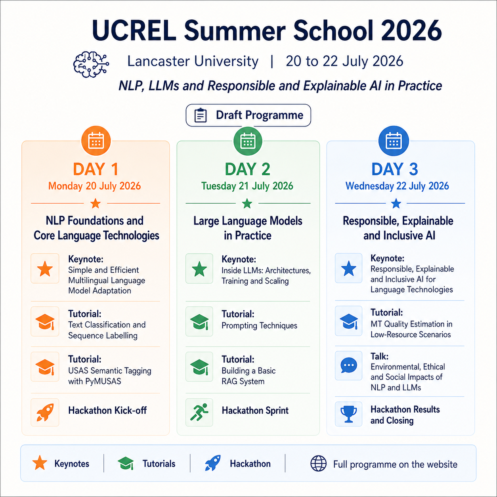

<div align="center">

# UCREL Summer School 2026

**Lancaster University · 20 to 22 July 2026**

*Draft programme repository for the UCREL Summer School 2026*


<!--  -->
<!-- NLP, LLMs and Responsible and Explainable AI in Practice -->

</div>

---

## Overview

This repository contains the draft programme and related materials for the **UCREL Summer School 2026**, hosted at **Lancaster University** from **20 to 22 July 2026**.

The 2026 theme is:

> **NLP, LLMs and Responsible and Explainable AI in Practice**

The summer school is expected to bring together up to **50 participants** from a broad range of AI-related fields, including natural language processing, machine learning, computer science, linguistics, digital humanities, and applied AI.

For the current public UCREL summer school page, see the [UCREL NLP Summer School site](https://ucrel.lancaster.ac.uk/uss2026/).

---

## Programme at a glance

> Add your banner or programme graphic to the repository and update the path below if needed.

<p align="center">
  
</p>

---

## Day 1 · Monday 20 July 2026
### NLP Foundations and Core Language Technologies

| Time | Session | Presenter |
|---|---|---|
| 09:00 to 09:30 | **Registration and Coffee**<br>Arrivals, badges, Wi-Fi, Slack or Teams setup | |
| 09:30 to 10:00 | **Opening and Welcome Remarks** | _[Dr Ignatius Ezeani](https://www.lancaster.ac.uk/scc/about-us/people/ignatius-ezeani)<br>[Prof Ruslan Mitkov](https://www.lancaster.ac.uk/scc/about-us/people/ruslan-mitkov)_ |
| 10:00 to 11:00 | **Keynote**<br>*Simple and Efficient Multilingual Language Model Adaptation* | _[Prof Nikos Aletras](https://sheffield.ac.uk/cs/people/academic/nikos-aletras)_<br>_Professor of NLP_<br>_Sheffield University_|
| 11:00 to 11:15 | **Coffee and Tea Break** |
| 11:15 to 13:00 | **Session 1: Tutorial**<br>*NLP Pipeline for Text Classification and Sequence Labelling* |_[Dr Daisy Lal](https://www.lancaster.ac.uk/scc/about-us/people/daisy-lal)_|
| 13:00 to 14:00 | **Lunch Break and Networking** |
| 14:00 to 15:30 | **Session 2: Tutorial**<br>*Introduction to the USAS Semantic Tagging Framework with PyMUSAS* | _[Prof Paul Rayson](https://www.lancaster.ac.uk/scc/about-us/people/paul-rayson)<br>[Dr Andrew Moore](https://www.lancaster.ac.uk/scc/about-us/people/andrew-moore)_ |
| 15:30 to 15:45 | **Coffee and Tea Break** | 
| 15:45 to 16:30 | **Session 3: To be Confirmed**<br>Speaker or session details to follow |_[Dr John Vidler](https://www.lancaster.ac.uk/scc/about-us/people/john-vidler)_|
| 16:30 to 17:00 | **Session 4: Hackathon Kick-off**<br>Challenge briefing, team formation, idea scoping |_[Dr Tharindu Ranasinghe](https://www.lancaster.ac.uk/scc/about-us/people/tharindu-ranasinghe)_<br>_[Dr Andrew Moore](https://www.lancaster.ac.uk/scc/about-us/people/andrew-moore)_<br>_[Dr John Vidler](https://www.lancaster.ac.uk/scc/about-us/people/john-vidler)_|

---

## Day 2 · Tuesday 21 July 2026
### Large Language Models in Practice

| Time | Session | Presenter |
|---|---|---|
| 09:00 to 09:30 | **Coffee and Networking**<br>Recap Day 1, outline Day 2 | |
| 09:30 to 10:30 | **Keynote**<br>*Inside LLMs: Architectures, Training and Scaling* | To be confirmed|
| 10:30 to 11:00 | **Coffee and Tea Break** | |
| 11:00 to 13:00 | **Session 5: Tutorial**<br>*LLM Prompting Techniques: RTCF, Few-shot, CoT, RAG and Constraints* | _Chenji Jin, David Wu_<br>_[Dr Scott Piao](https://www.lancaster.ac.uk/sci-tech/about-us/people/scott-piao)_|
| 13:00 to 14:00 | **Lunch Break and Networking** |
| 14:00 to 15:30 | **Session 6: Tutorial**<br>*Building a Basic RAG System: indexing a corpus, retrieval, prompting, and evaluating responses* | _[Dr Hansi Hettiarachchi](https://www.lancaster.ac.uk/sci-tech/about-us/people/hansi-hettiarachchi)_ |
| 15:30 to 16:00 | **Coffee and Tea Break** | |
| 16:00 to 17:00 | **Session 7: Hackathon Sprint**<br>Code and spec review, short clinic, discussions and support |_[Dr Tharindu Ranasinghe](https://www.lancaster.ac.uk/scc/about-us/people/tharindu-ranasinghe)_<br>_[Dr Andrew Moore](https://www.lancaster.ac.uk/scc/about-us/people/andrew-moore)_<br>_[Dr John Vidler](https://www.lancaster.ac.uk/scc/about-us/people/john-vidler)_|

---

## Day 3 · Wednesday 22 July 2026
### Responsible, Explainable and Inclusive AI

| Time | Session | Presenter |
|---|---|---|
| 09:00 to 09:30 | **Coffee and Networking**<br>Recap, hackathon reminders |
| 09:30 to 10:30 | **Keynote**<br>*Responsible, Explainable and Inclusive AI for Language Technologies* | _[Dr Jacki O'Neill](https://www.microsoft.com/en-us/research/people/jaoneil/?msockid=2b202e1c0a2e65503c19394c0b9b64a0)_<br>_Director, Microsoft Research_<br>Nairobi, Kenya|
| 10:30 to 11:00 | **Coffee and Tea Break** |
| 11:00 to 13:00 | **Session 8: Tutorial**<br>*Machine Translation Quality Estimation in Low-Resource Scenarios* | _[Dr Tharindu Ranasinghe](https://www.lancaster.ac.uk/scc/about-us/people/tharindu-ranasinghe)_<br>_[Damith Dola Mullage](https://www.lancaster.ac.uk/scc/about-us/people/damith-dola-mullage)_|
| 13:00 to 14:00 | **Lunch Break and Networking** |
| 14:00 to 15:00 | **Session 9: Talk**<br>*Environmental, Ethical and Social Impacts of NLP and Large Language Models* |
| 15:00 to 15:30 | **Hackathon Results**<br>Team pitches, winners and prize presentation |_[Dr Tharindu Ranasinghe](https://www.lancaster.ac.uk/scc/about-us/people/tharindu-ranasinghe)_<br>_[Dr Andrew Moore](https://www.lancaster.ac.uk/scc/about-us/people/andrew-moore)_<br>_[Dr John Vidler](https://www.lancaster.ac.uk/scc/about-us/people/john-vidler)_|
| 15:30 to 16:00 | **Closing**<br>Reflections, announcements, certificates and group photo | _[Prof Paul Rayson](https://www.lancaster.ac.uk/scc/about-us/people/paul-rayson)<br>[Dr Ignatius Ezeani](https://www.lancaster.ac.uk/scc/about-us/people/ignatius-ezeani)_|

---

## Key themes

- **Foundational NLP workflows** for classification, sequence labelling, and semantic analysis
- **Large language models in practice**, including prompting, RAG, and system-building
- **Responsible, explainable, and inclusive AI** for language technologies
- **Hands-on collaboration** through tutorials, networking, and a multi-day hackathon

---

## Intended audience

The programme is designed for:

- PhD students and early-career researchers
- Research assistants and postdoctoral researchers
- Software developers and data scientists
- Researchers and practitioners working across NLP, AI, linguistics, and digital humanities

---

<!-- ## Repository contents

Suggested structure:

```text
.
├── README.md
├── assets/
│   ├── ucrel-summer-school-2026-programme.png
│   └── ucrel-summer-school-2026-schedule.png
├── programme/
│   └── draft-programme.md
└── social/
    └── programme-card.png
```

--- -->

## Notes

- This programme is a **draft** and may be updated as speakers and session details are confirmed.
- Session titles and timings are subject to minor refinement.
- **Session 3** on Day 1 is currently to be confirmed.

---

## Maintainers
Dr Ignatius Ezeani and the **UCREL Summer School 2026 Organising Team**, Lancaster University, UK

---

<p align="center">
  <sub>Draft programme · Subject to minor updates</sub>
</p>
